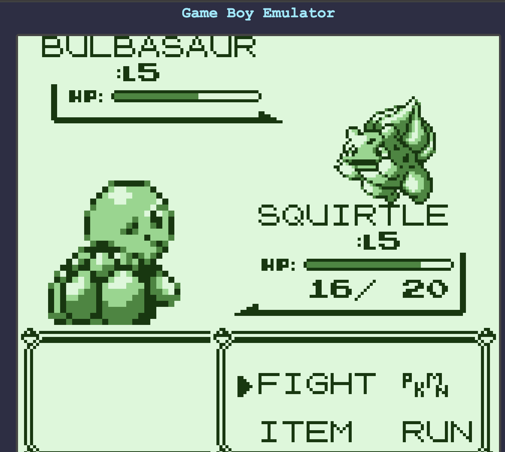

# Game Boy Emulator — Built with DeepSeek V4 Pro + Claude Code

> An HTML-based Game Boy emulator with full CPU instruction set, PPU rendering, and MBC1/MBC3 cartridge support. Built entirely through AI-assisted coding without manual debugging.

## Tech Stack

| Role | Tool |
|------|------|
| **AI Model** | [DeepSeek V4 Pro](https://deepseek.com) |
| **Coding Agent** | [Claude Code](https://claude.ai/code) |
| **Coding Guidelines** | [Andrej Karpathy's LLM Coding Skills](SKILL.md) |
| **Runtime** | Single-file HTML + JavaScript, runs in browser |

## Features

- **Full CPU emulation**: 245 standard opcodes + 256 CB-prefix opcodes
- **PPU rendering**: Background, Window, Sprite support with correct priority handling
- **Timer & Interrupt system**: LYC=LY edge detection, HALT bug behavior
- **Joypad input**: Keyboard controls for D-Pad, A/B, Start/Select
- **MBC1/MBC3 cartridge support**: ROM banking, RAM banking, RTC
- **DMA transfer**: OAM DMA
- **dmg-acid2 compliance**: Pixel-accurate PPU rendering verified

## Quick Start

```bash
# 1. Clone the repo
git clone https://github.com/junchengliao/gb-emulator.git
cd gb-emulator

# 2. Open in browser
open gb-emulator.html

# 3. Load a .gb ROM file and click "Run"
```

## Controls

| Game Boy | Keyboard |
|----------|----------|
| D-Pad    | Arrow Keys |
| A        | Z |
| B        | X |
| Start    | Enter |
| Select   | Space |

## Test Results

- **CPU Instruction Tests**: 11/11 individual tests **all passed**
- **dmg-acid2**: Pixel-accurate reference output matched
- **Pokémon Blue (宝可梦 蓝)**: Successfully booted and playable

## Screenshots

### Pokémon Blue (宝可梦 蓝) Running



## Project Structure

| File | Description |
|------|-------------|
| `gb-emulator.html` | Browser-based Game Boy emulator (main deliverable) |
| `run-acid2.js` | Node.js emulator for dmg-acid2 debugging |
| `test-runner.js` | Automated CPU instruction test framework |
| `emulator-debug-notes.md` | Full development log & bug fix documentation |
| `SKILL.md` | Karpathy coding guidelines used during development |

## Bugs Fixed (8 total)

1. **Sprite X-coordinate horizontal flip** — tile bit traversal order was inverted
2. **OBP0/OBP1 low 2-bit masking** — missing hardware-accurate bit masking
3. **CB-prefix instruction cycle counts** — incorrect timing (4-8 → 8-16 cycles)
4. **BG color index tracking** — OBJ-to-BG priority needed bgColorIdx
5. **STAT LYC=LY edge detection** — repeated triggering fixed to rising-edge only
6. **Sprite rendering priority** — missing X-coordinate sort for sprite ordering
7. **CYCLES_PER_FRAME** — incorrect frame cycle count (17556 → 70224)
8. **HALT exit condition** — exit on any IF flag, not just IE-enabled ones

See [emulator-debug-notes.md](emulator-debug-notes.md) for detailed analysis.

---

*Built as an experiment to evaluate DeepSeek V4 Pro's coding capability with Claude Code orchestration and Karpathy-style guidelines.*
